## App1

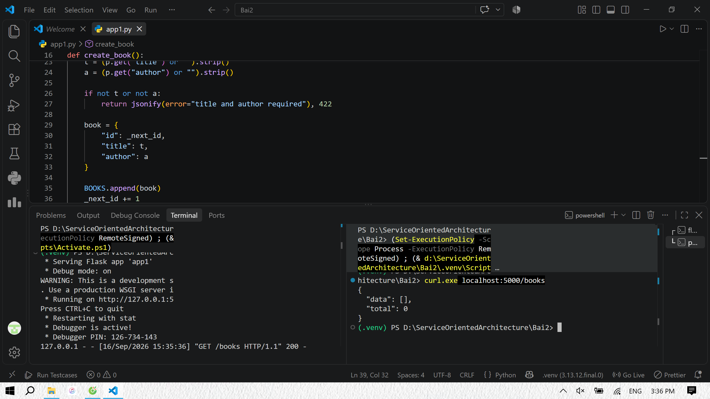
Dùng GET /books để lấy danh sách các sách, bao gồm data (thông tin các sách) và total (tổng số sách).

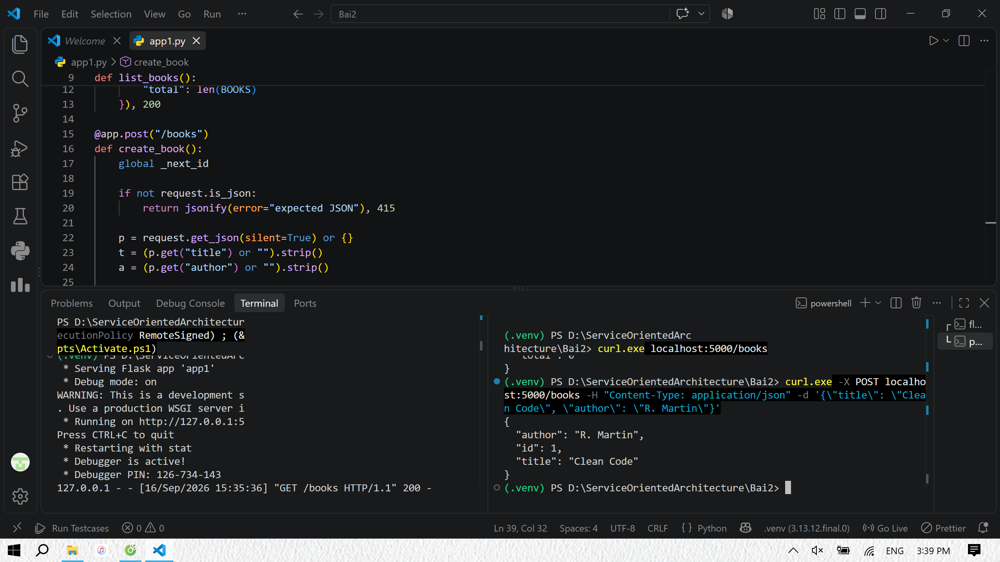
Dùng POST /books để thêm sách mới.

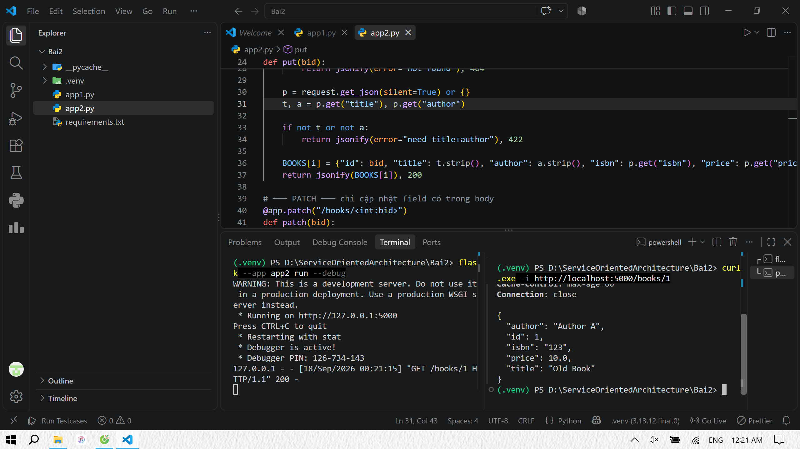
Dùng GET /books/bid để xem thông tin sách có id = bid, cache 60s.

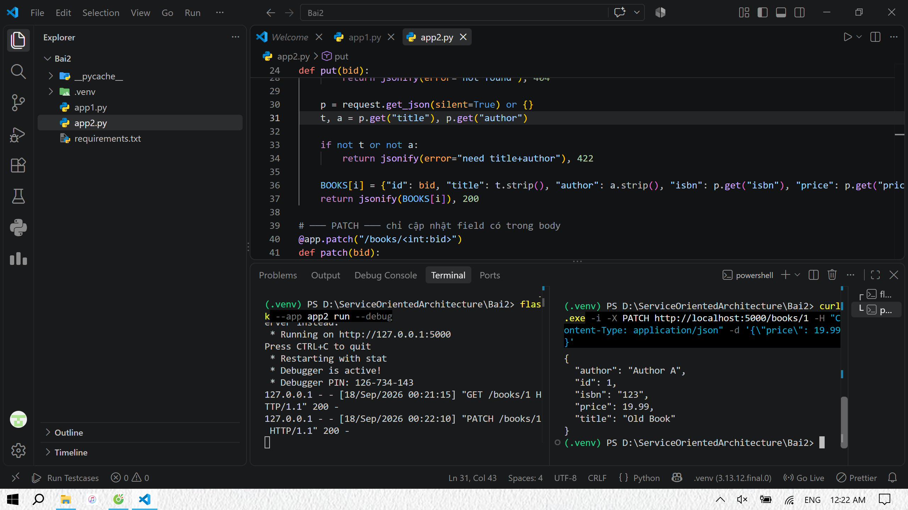
Dùng PATCH /books/bid để chỉnh sửa giá tiền của sách có id = bid.

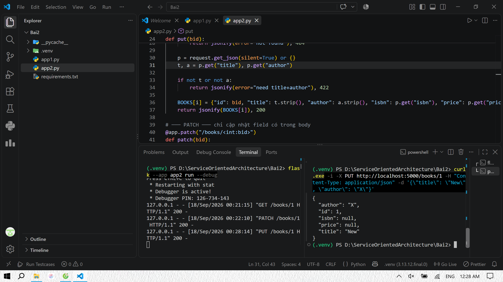
Dùng PUT /books/bid để thay thế toàn bộ các trường của cuốn sách có id = bid thành cuốn sách mới.

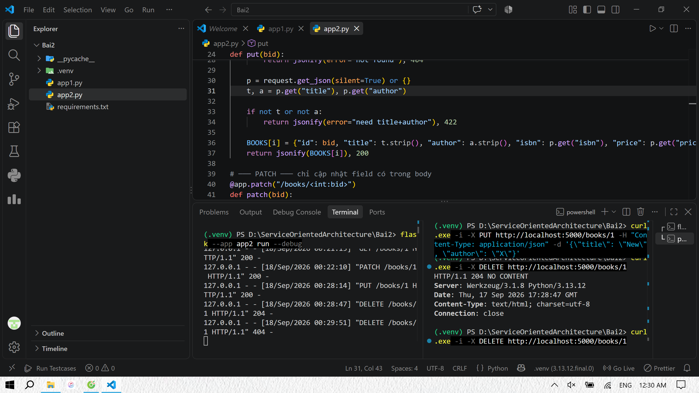
Dùng DELETE /books/bid để xóa cuốn sách có id = bid.

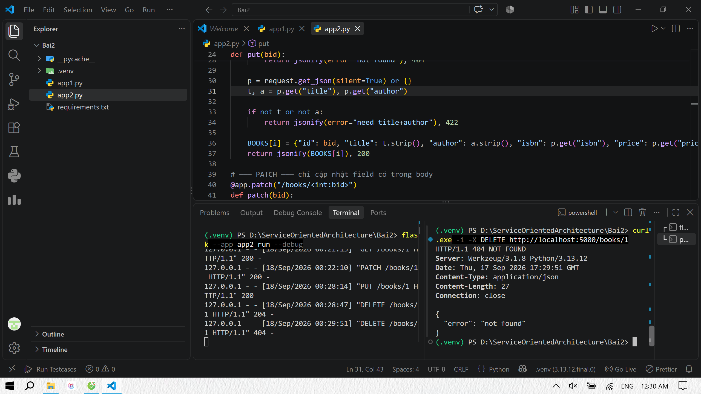
Dùng DELETE /books/bid một lần nữa, sách không còn trong database nên báo lỗi 404 NOT FOUND.

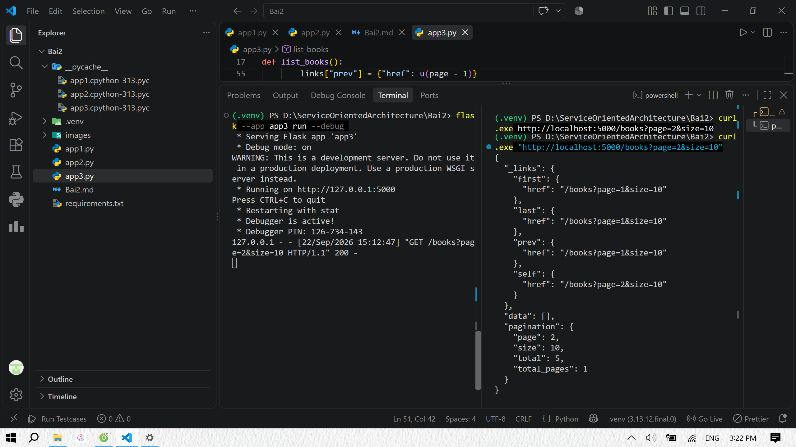
Xem danh sách các sách ở trang 2 với size = 10. Khi đó data = [] do chỉ có 5 cuốn sách trong DB. Không có liên kết đến trang sau.

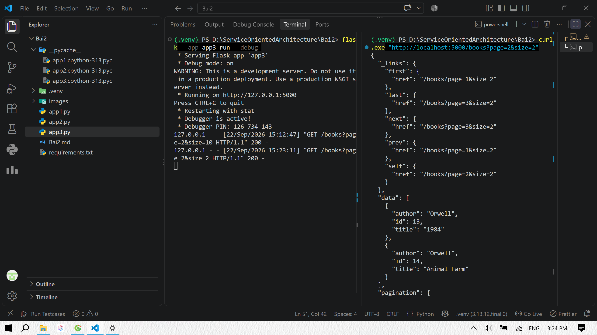
Xem danh sách các sách ở trang 2 với size = 2. Khi đó sẽ có tổng cộng 3 trang, có liên kết đến trang trước và trang sau.

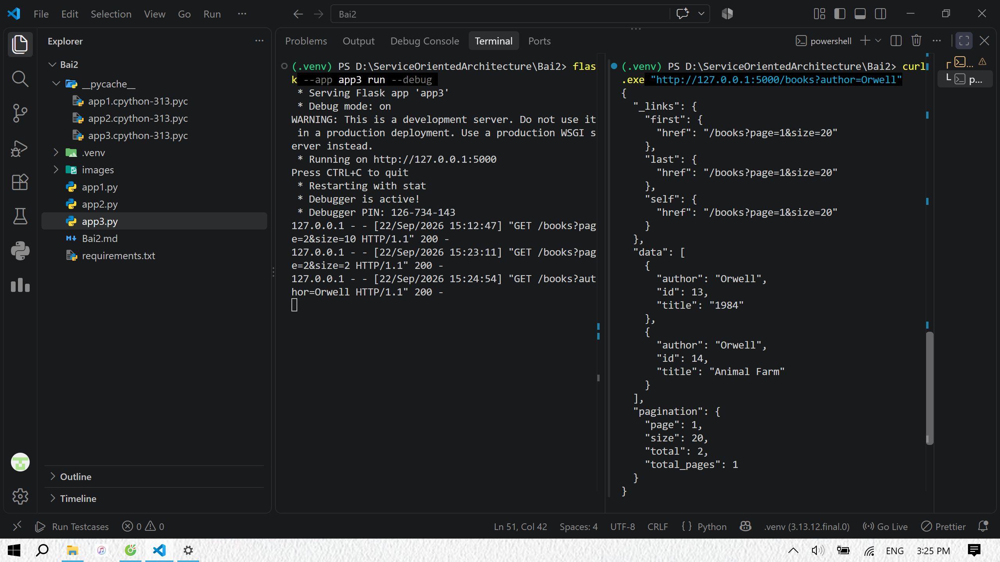
Xem các sách của tác giả Orwell.

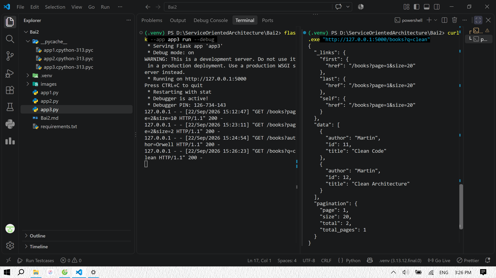
Xem các sách có chứa từ "clean" trong tiêu đề.

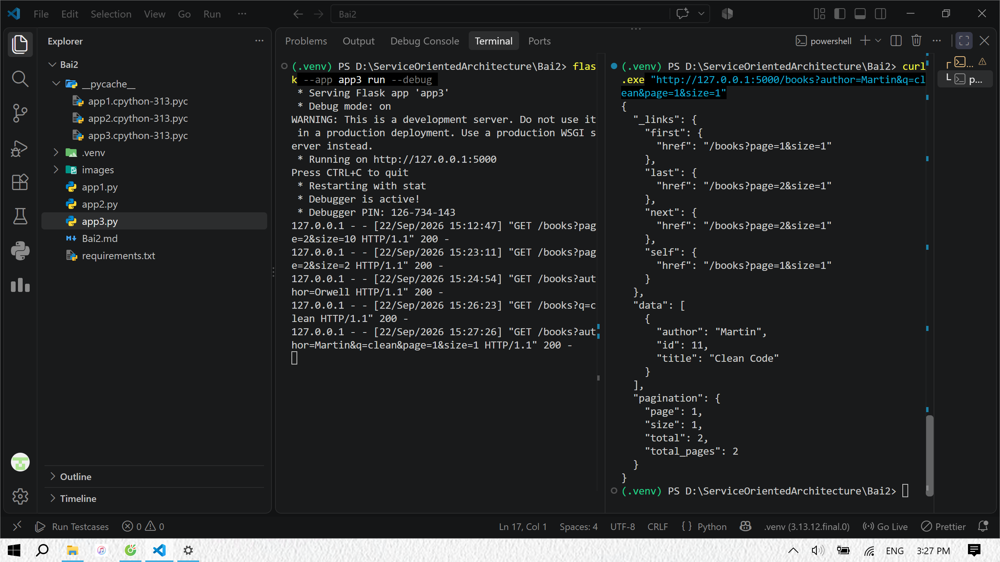
Xem các sách của Martin có chữ "clean", lấy trang 1, size 1.

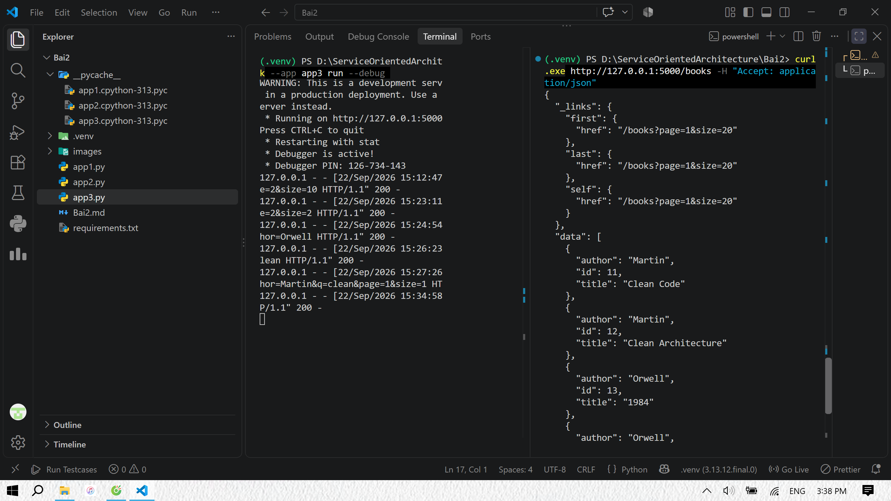
Yêu cầu trả về định dạng JSON.
