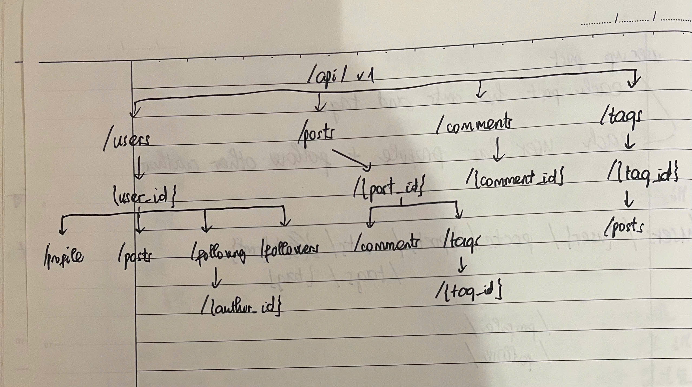
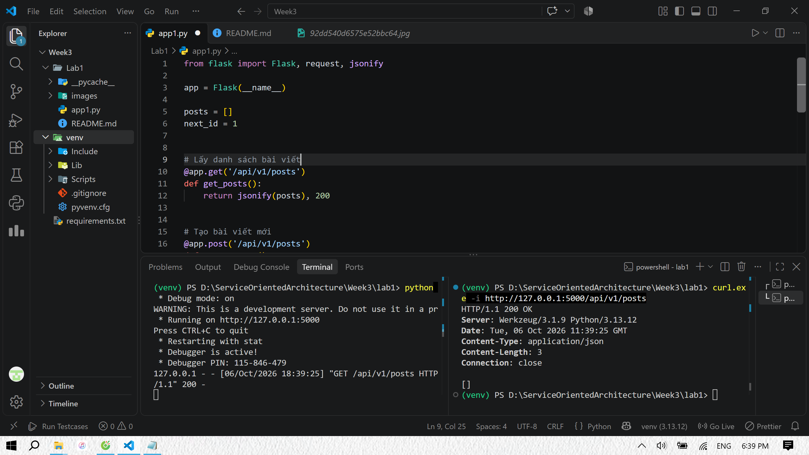
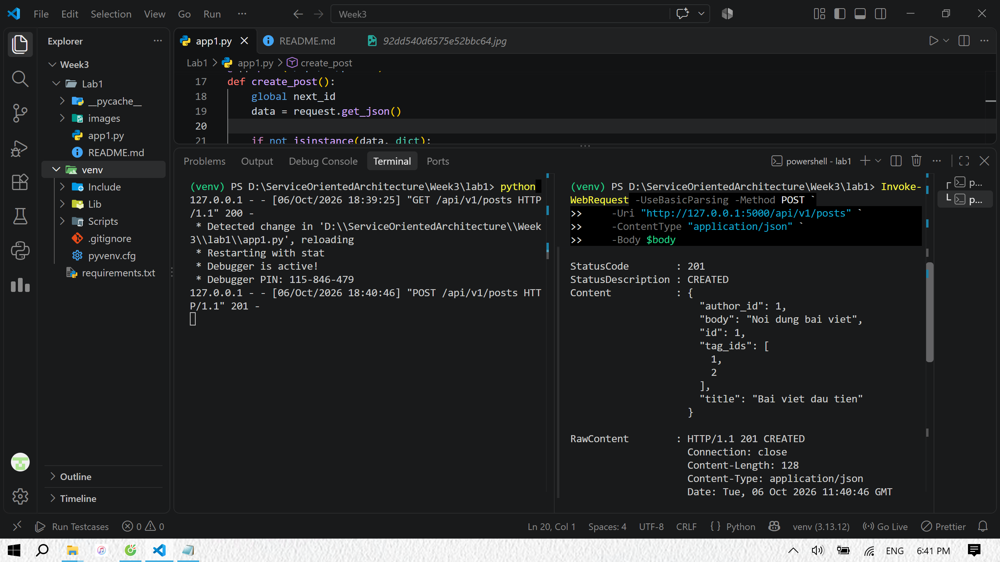
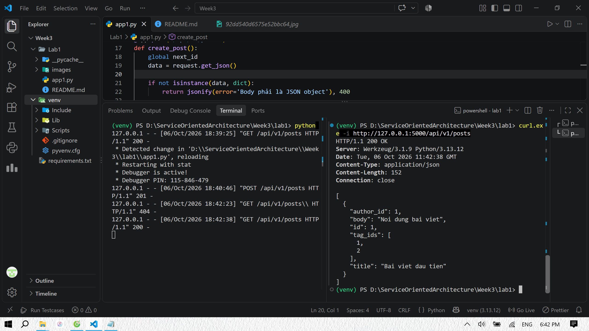
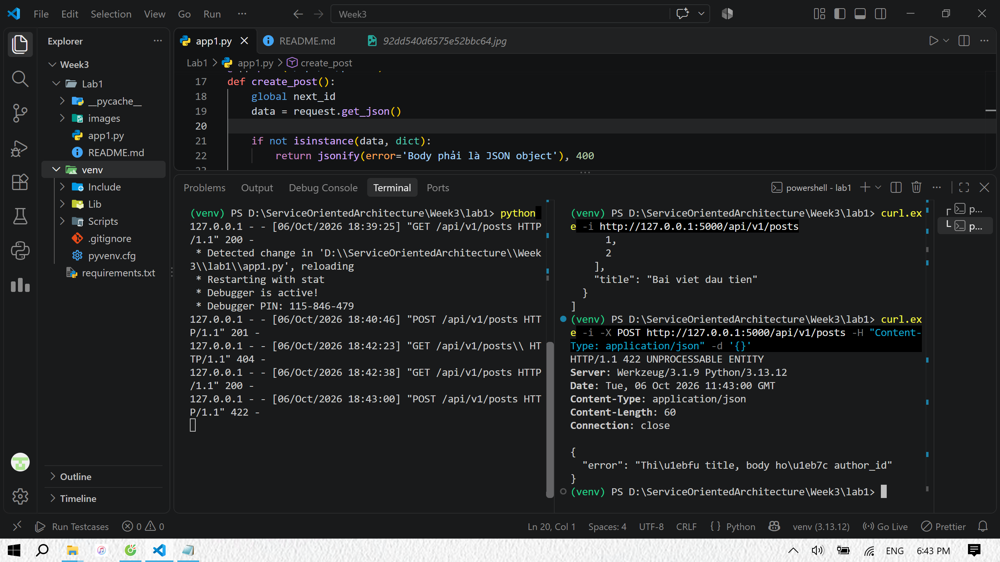
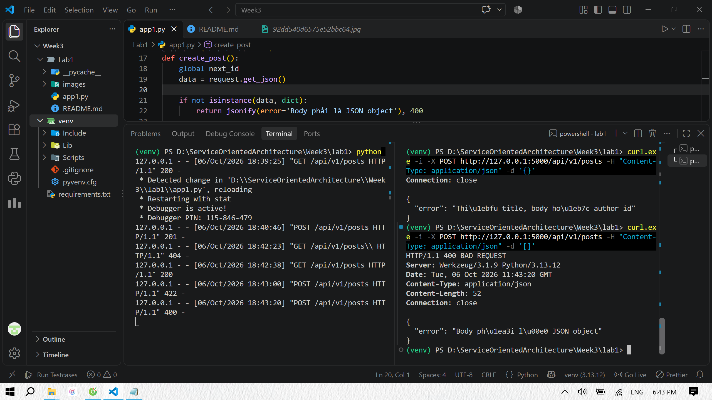

# Lab 1 — Thiết kế resource cho Blog API

## 1. Xác định tài nguyên và quan hệ

User: Người dùng, có thể đăng bài và theo dõi tác giả khác (id, username)

Profile: Hồ sơ duy nhất của một người dùng (user_id, display_name, bio, avatar_url)

Post: Bài viết của một tác giả (id, author_id, title, body, created_at)

Comment: Bình luận của người dùng trên một bài (id, post_id, author_id, body)

Tag: Thẻ dùng chung để phân loại bài (id, name)

Following: Quan hệ người dùng theo dõi tác giả khác (follower_id, author_id)

Quan hệ: User-Profile là 1-1; User-Post, Post-Comment và User-Comment là 1-n; Post-Tag là n-n; User-User qua Following là n-n có hướng. A theo dõi B không có nghĩa B theo dõi A. Không cho phép tự theo dõi hay tạo trùng cặp theo dõi.

## 2. Phân loại collection / item / sub-resource

Chọn tiền tố `/api/v1`. `api` đánh dấu API, `v1` là version segment. Chỉ đưa thay đổi không tương thích sang version mới; thêm chức năng tương thích có thể giữ v1. Trong bảng dưới, mọi đường dẫn đều có tiền tố `/api/v1`.

- **Collection**: tập tài nguyên, ví dụ `/posts`.
- **Item**: một tài nguyên xác định, ví dụ `/posts/{post_id}`.
- **Sub-resource**: tài nguyên gắn với tài nguyên cha. Nó vẫn có thể là collection hoặc item; ví dụ `/posts/{post_id}/comments` là collection con, còn `/users/{user_id}/profile` là singleton con.

## 3. Sơ đồ cây endpoint

## 4. Triển khai Flask routes cho collection /posts

GET /api/v1/posts: Lấy danh sách bài viết

GET /api/v1/posts?author_id=1: Lọc bài của tác giả 1

POST /api/v1/posts: Tạo bài viết

GET /api/v1/posts/{post_id}: Phần bổ sung để đọc item trong Location

### Body tạo bài

{
"title": "Thiết kế Blog API",
"body": "Nội dung bài viết đầu tiên.",
"author_id": 1,
"tag_ids": [1, 2]
}

## 5. Kết quả test

Lấy danh sách bài viết.

Tạo một bài viết.

Xem lại danh sách sau khi thêm.

Tạo bài nhưng thiếu các trường bắt buộc.

Gửi mảng thay vì JSON object.
