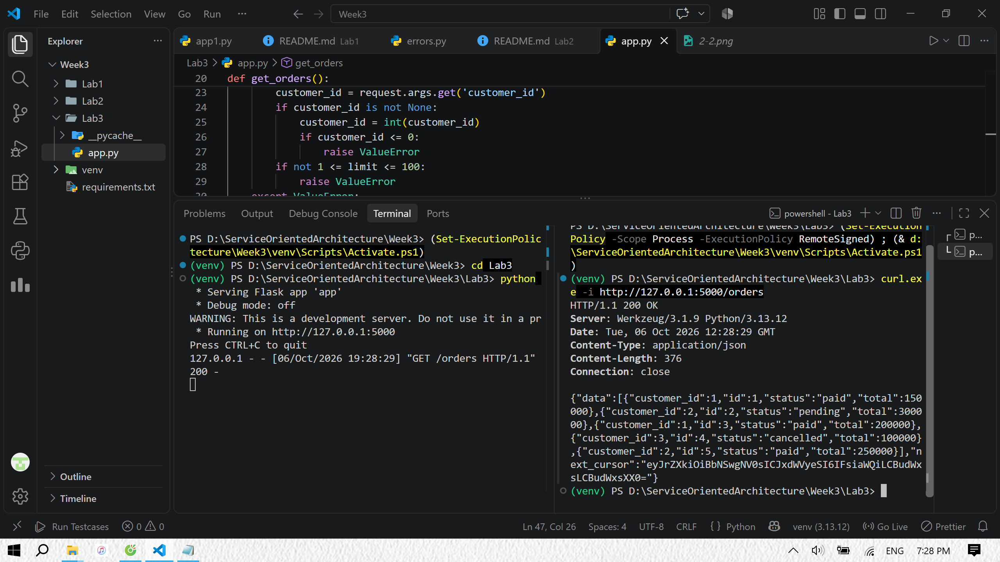
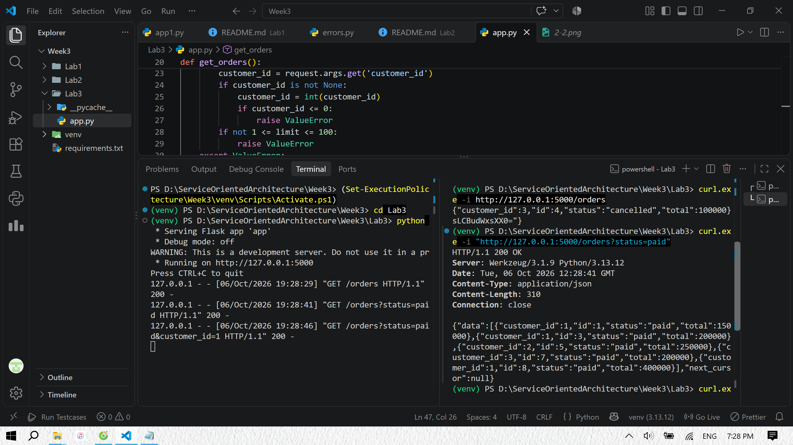
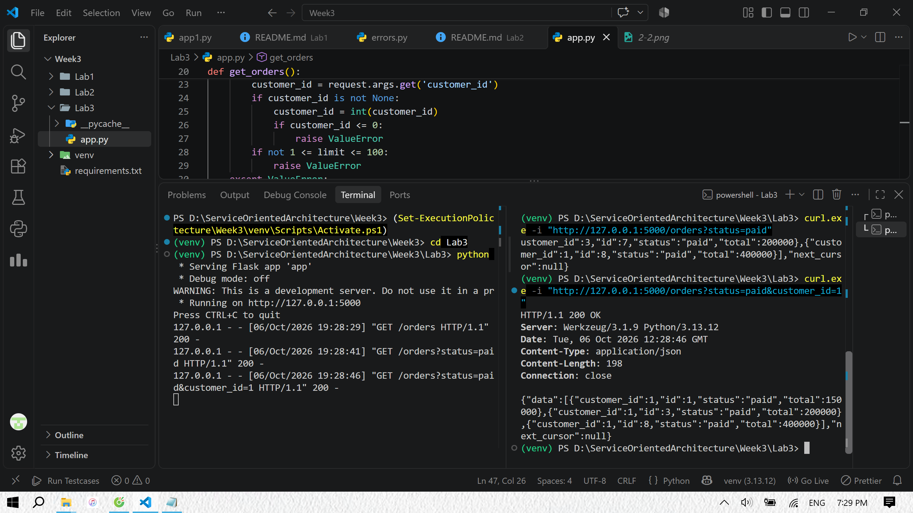
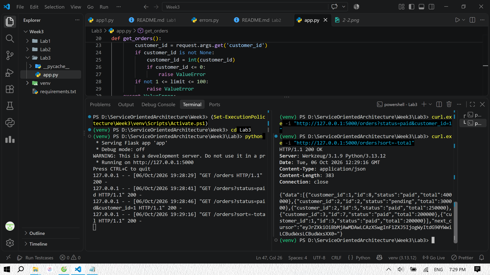
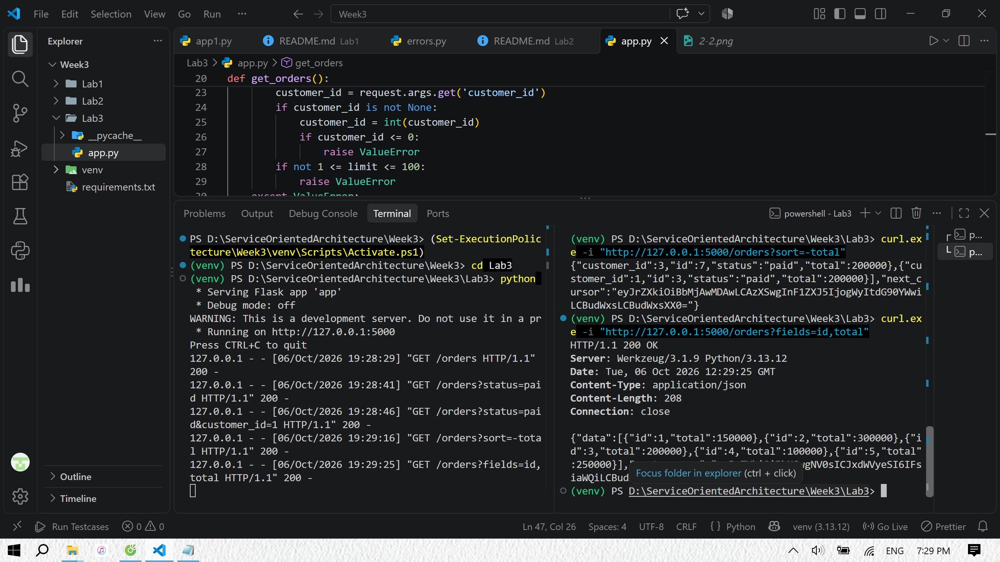
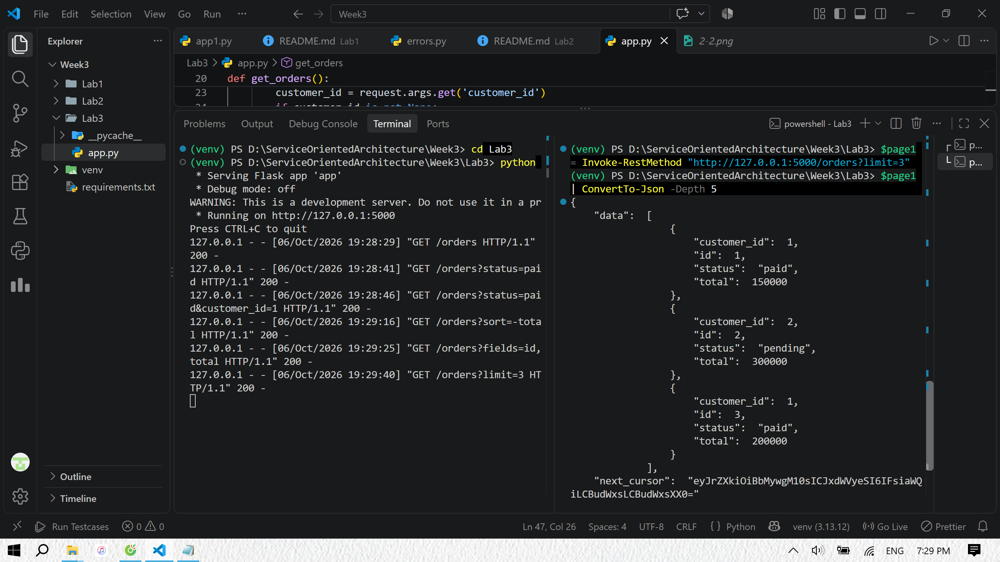
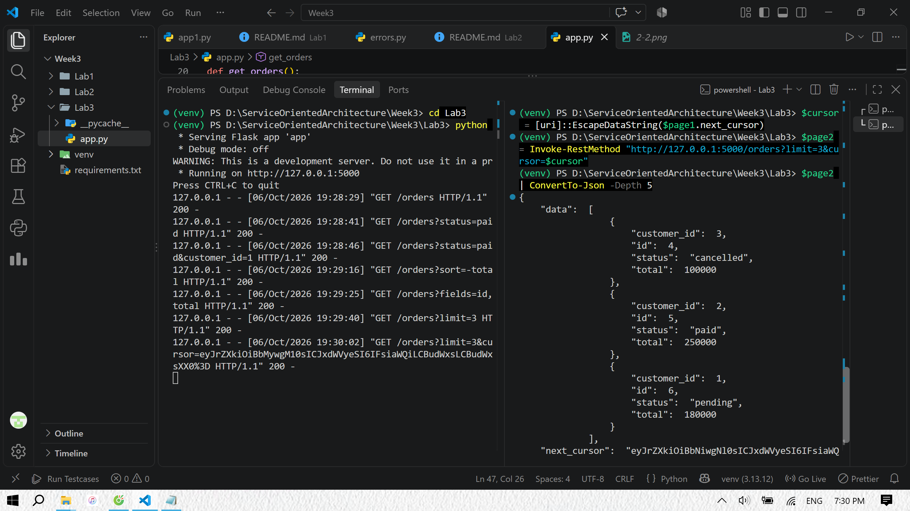
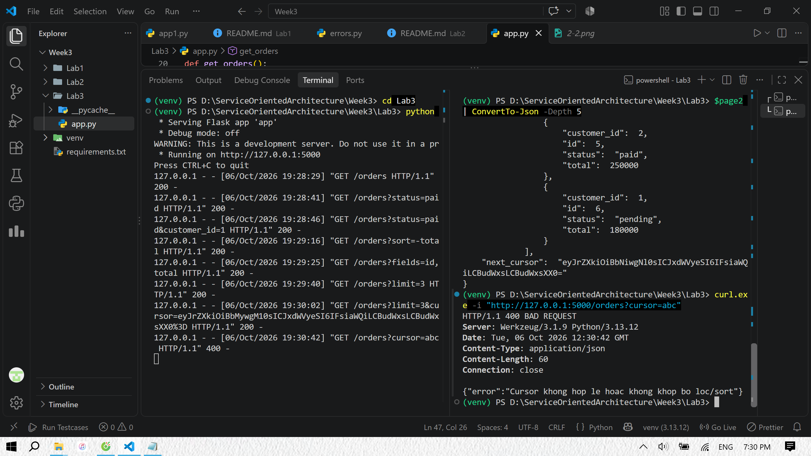
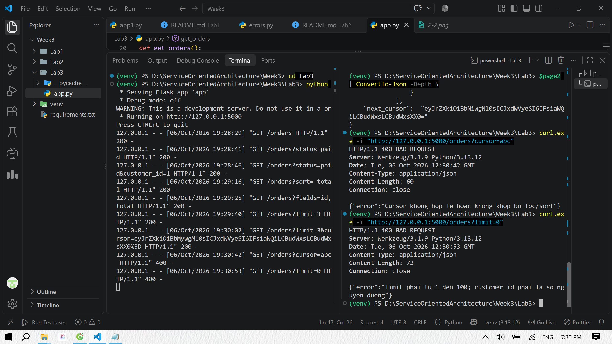
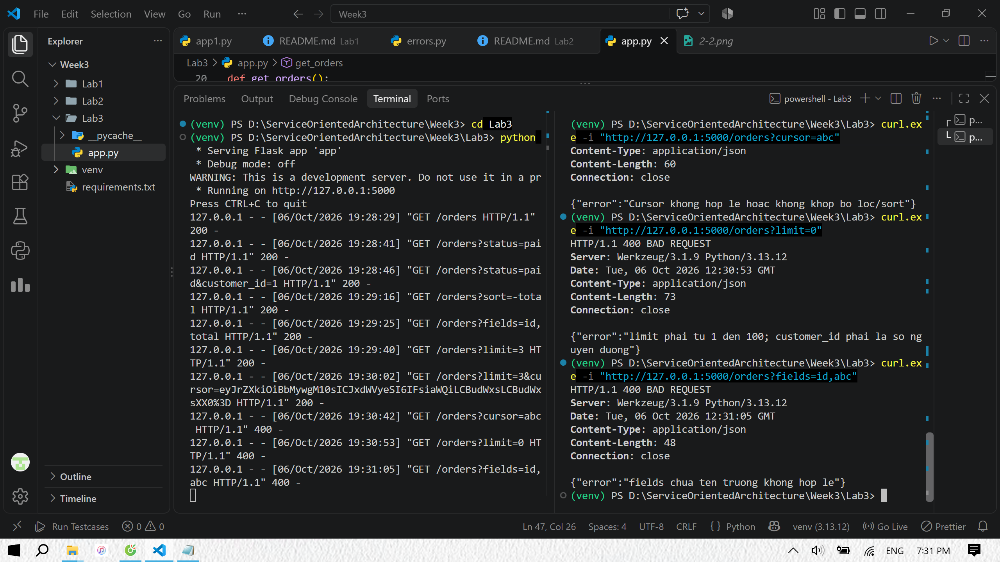

Lấy danh sách, mặc định 5 đơn.

Lọc đơn đã thanh toán.

Lọc đơn đã thanh toán của khách hàng 1.

Sắp xếp tổng tiền giảm dần.

Chỉ lấy id và total.

Lấy trang đầu, gồm ID 1, 2, 3.

Dùng next_cursor lấy trang tiếp theo, gồm ID 4, 5, 6.

Cursor hỏng.

Số lượng không hợp lệ.

Tên trường không tồn tại.
